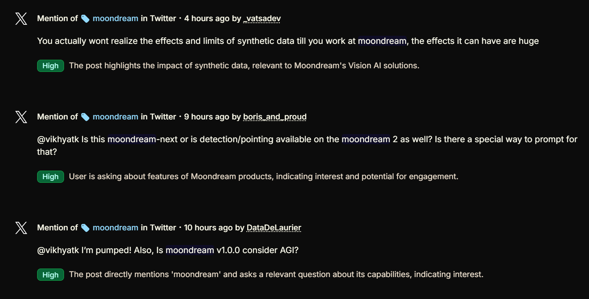
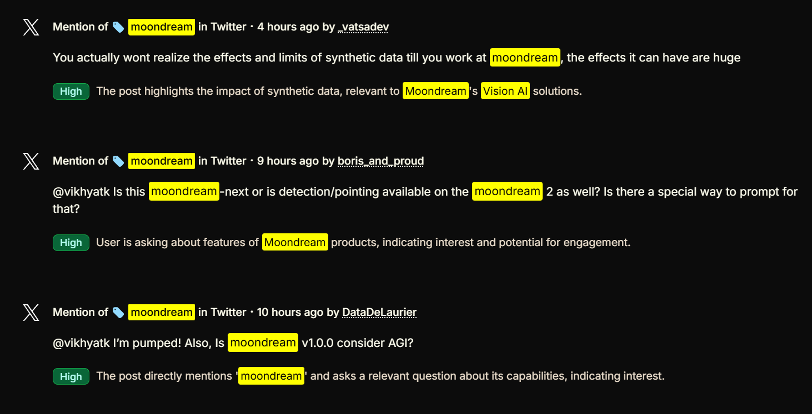

# Moondream & Vision AI Highlighter Extension

## Overview
A Chrome extension that automatically highlights mentions of Moondream, Vision Language Models (VLMs), and related AI vision technologies across any webpage. The extension uses intelligent text detection to highlight terms while maintaining good performance.

## Before & After

| Before | After |
|--------|-------|
|  |  |

The extension automatically detects and highlights relevant AI vision terms while preserving the original page layout and functionality.

## Features
- Real-time highlighting of AI vision-related terms
- Case-insensitive matching
- Performance-optimized for long pages
- Only highlights visible content (similar to browser Ctrl+F)
- Handles dynamic content and AJAX-loaded text
- Smooth hover effects on highlighted terms
- Works across all websites
- Preserves page functionality and layout

## Installation
1. Clone this repository or download the source code
2. Open Chrome and navigate to `chrome://extensions/`
3. Enable "Developer mode" in the top right
4. Click "Load unpacked" and select the extension directory

## Technical Details

### Performance Optimizations
- Uses Intersection Observer to only process visible content
- Throttled scroll handling
- Efficient regex matching
- Skips hidden elements and irrelevant content
- Prevents double-processing of highlighted content

### Excluded Elements
The extension won't highlight text in:
- `<script>` tags
- `<style>` tags
- `<textarea>` elements
- `<input>` fields
- `<code>` blocks
- `<pre>` elements
- Already highlighted content

### Term Categories
- Core Moondream terms
- Vision Language Models (VLMs)
- Related Vision AI terms
- Similar models/companies
- Research/Technical terms
- Common abbreviations
- Research frameworks

## Changelog

### Version 1.0.0 (2024-11-21)
Initial release with the following features:
- Comprehensive keyword list including 100+ AI vision-related terms
- Performance-optimized highlighting system
- Visibility-based content processing
- Dynamic content handling
- Smooth hover effects
- Error handling and logging

### Known Issues
- None reported yet

## Future Enhancements
- User-configurable term list
- Custom highlight colors
- Statistics tracking for highlighted terms
- Export/import settings
- Keyboard shortcuts
- Right-click context menu integration

## Contributing
Feel free to submit issues, fork the repository, and create pull requests for any improvements.

## Technical Requirements
- Chrome Browser (Version 88 or higher recommended)
- Manifest V3 compatible

## License
MIT License

## Credits
Created for the Moondream community to enhance discovery of AI vision-related content across the web.

## Support
For issues or feature requests, please use the GitHub issues page. 